<h1> MSEUF Portal Technology Corporation </h1>

<h2> Overview </h2>

The MSEUF Technology Corporation is an e-commerce web-based application that allows user to browse and purchase various technology products in different categories.

<h2> Main Page </h2>

The main page displays the list of categories, each representing a type of technology products. Users can click on a category to view the corresponding products they want. Furthermore, it also includes the “view cart” button that allows user what they bought and what’s the price of the product and their total price of what it all bought.

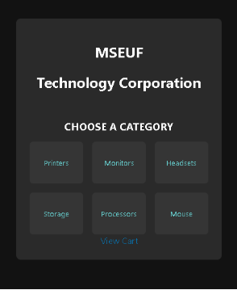

These are different pages in the list of product that includes the different kind of printers, monitors, headsets, storage, processors, and mouse. Each product includes a “Buy Now” button, which adds the product to the shopping cart when clicked.

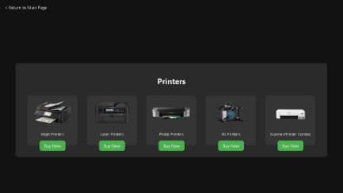

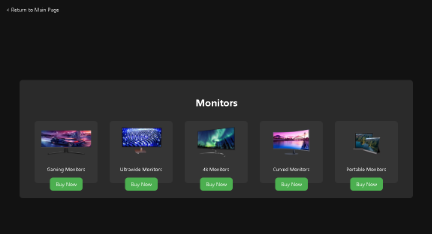

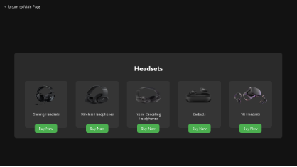

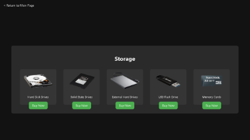

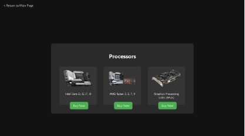

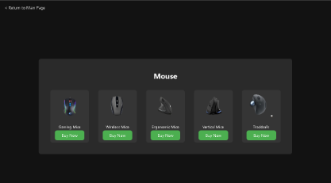

When you clicked the “Buy Now” button, it will notify you that you purchased or added a product in your cart.

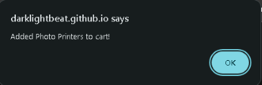

If you add the same product, it will notify you that you already purchased a product to your cart. 

/Since the topic is only combination that has no repetition, it did specify that the combination that has no repetition because if it did, it should have repetition “word” in the topic\

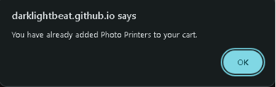

If your cursor was pointing on a specific product, it will show a pop-up description of a product on what’s their functionality and their pros.

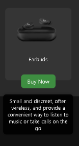            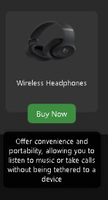

If you clicked the “View Cart” button in the main page, it will show the products that you have bought and their prices. The users can remove the item if they don’t want because of the price or they mis-click it. It also adds up all the prices and display the total amount of the products the user purchased.

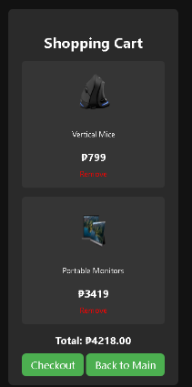

If you try to go back to main page and you want to purchase another product, the products there will be still there unless you remove them.

/ You can see that there’s a faint light there in the “Back to Main” button. /

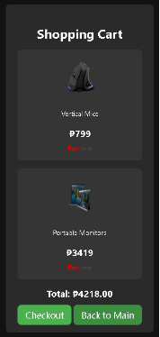

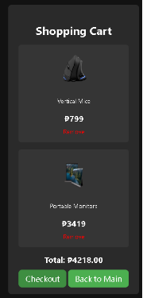

When you try to check out all the products you purchased will be remove and it will be back to the original format where the users can shop again for another.

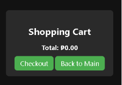

<h2> Logic of the Code </h2>

<li> The website uses JavaScript to make the user experience more interactive. On the main page, JavaScript helps redirect users to the correct category page when they click on a category item </li>
<li> On the shopping cart page, JavaScript is used to display the products and their prices, update the total cost of the items in the cart, and remove items when the "Remove" button is clicked. Additionally, when the "Checkout" button is clicked, JavaScript clears the cart and redirects the user back to the main page. </li>

<h2> User Interaction </h2>

User can interact with the application by:

1\. Browsing the categories on the main page and clicking on a category to view the corresponding products

2\. Adding products to the shopping cart by clicking on the category item

3\. Viewing the shopping cart and removing items by clicking on the "Remove" button

4\. Completing the purchase by clicking on the "Checkout" button

<h2> Running the System </h2>

To run the system, simply open the HTML files in a web browser. The application does not require any command-line interface (CLI) or graphical user interface (GUI) inputs.

<h2> Formula Used </h2>

The application does not use any specific formulas, as it is a simple e-commerce application. However, the total cost of the items in the cart is calculated by summing up the prices of each item.

